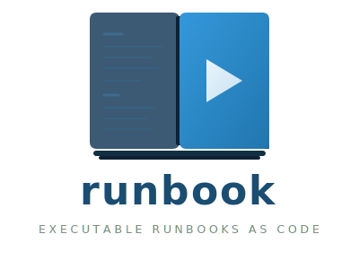

<p align="center">
  
</p>

<p align="center">
  <a href="https://github.com/runbookdev/runbook/actions"></a>
  <a href="LICENSE"></a>
  <a href="https://goreportcard.com/report/github.com/runbookdev/runbook"></a>
</p>

---

## 😤 The problem

Operations runbooks are broken in every organisation. The pain manifests in three ways:

**Stale documentation** — Wiki-based runbooks (Confluence, Notion, Google Docs) decay within weeks.
During a 3am incident, the on-call engineer discovers half the steps reference services that no longer exist.

**Unreadable automation** — Script-based runbooks (bash, Makefiles) are executable but lack context,
skip explanation, have no rollback logic, and are dangerous to run without understanding every line.

**Vendor lock-in** — Playbook tools (PagerDuty Runbooks, Rundeck) are proprietary, expensive, and cannot
be version-controlled, reviewed in PRs, or composed with other tools.

The consequences are measurable and significant:

- Increased MTTR during incidents because procedures are outdated or missing
- Onboarding friction — new engineers cannot self-serve operational knowledge and depend on tribal knowledge
- Repeated incidents from the same root cause because post-incident improvements are never codified
- Compliance risk — audit trails of operational actions are incomplete or nonexistent
- Engineering time wasted maintaining duplicate sources of truth (wiki + scripts)

### Why now

Several converging trends make this the right moment:

- **GitOps maturity** — teams already version-control infrastructure (Terraform, Kubernetes manifests). Runbooks are the last major operational artifact not yet managed as code.
- **Incident management evolution** — tools like PagerDuty, Incident.io, and FireHydrant have professionalised incident response, but the actual procedures remain in wikis.
- **Compliance tightening** — SOC 2, ISO 27001, and DORA regulations increasingly require auditable operational procedures. Manual wiki-based processes fail audits.
- **AI readiness** — structured, executable runbooks are the ideal substrate for AI-assisted operations.

## 💡 The solution

> **Documentation and automation are the same file.** When you update the command, you update the
> explanation in the same commit. They can never drift apart.

A **`.runbook`** file is extended Markdown with typed, fenced code blocks. The frontmatter defines
metadata, permissions, and approval rules. The Markdown body is the documentation. Specially-typed
code blocks (`check`, `step`, `rollback`, `wait`) are the executable units.

This means a single file is the document a human reads during an incident **and** the executable
procedure the system runs. It lives in your Git repo, is reviewed in PRs, and is tested in CI.

- 📄 A **human-readable document** that explains what, why, and how
- ⚡ An **executable program** with typed steps, preconditions, rollback logic, and environment awareness
- 🔀 A **version-controlled artifact** that lives alongside your code, reviewed in PRs

## 🚀 Quick start

```bash
# Install
brew install runbookdev/tap/runbook

# Scaffold from a template
runbook init --template=deploy my-deploy.runbook

# Preview (nothing runs)
runbook dry-run my-deploy.runbook --env staging

# Execute
runbook run my-deploy.runbook --env staging --var service=api --var version=2.4.0

# Review the audit log
runbook history
```

## 📖 Documentation

Full documentation is in the [`docs/`](docs/) folder:

| | |
|--|--|
| [Getting started](docs/getting-started.md) | Install, scaffold, and run your first runbook |
| [File format](docs/FORMAT.md) | Frontmatter, block types, and syntax reference |
| [CLI reference](docs/cli-reference.md) | All commands, flags, and exit codes |
| [Template variables](docs/variables.md) | `{{variable}}` resolution and built-ins |
| [Safety features](docs/safety.md) | Rollback, timeouts, confirmation gates, signal handling |
| [Security](docs/security.md) | Static analysis, secret redaction, secure temp files |
| [Audit logging](docs/audit.md) | Execution history and `runbook history` |
| [Configuration](docs/configuration.md) | `~/.runbook/config.yaml` |
| [Built-in templates](docs/templates.md) | 10 production-ready starting points |

## 🔨 Building from source

```bash
git clone https://github.com/runbookdev/runbook.git
cd runbook
make build    # requires Go 1.26+ and CGO
make test
```

## 🤝 Contributing

See [CONTRIBUTING.md](CONTRIBUTING.md). Bug reports, feature discussions, and documentation
PRs are all welcome.

## 📄 License

Apache 2.0 — see [LICENSE](LICENSE) for details.
